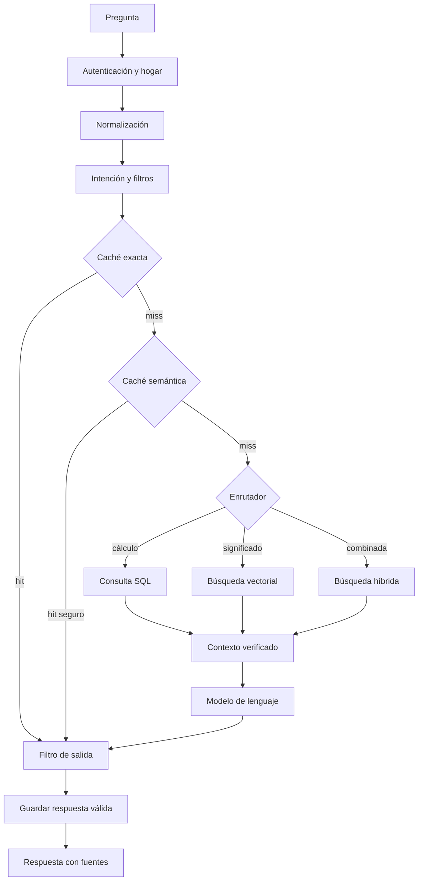

# Arquitectura de IA, RAG y caché semántica

## Objetivo

Permitir consultas financieras en lenguaje natural con respuestas rápidas, trazables y seguras. La IA interpreta y explica; PostgreSQL calcula, autoriza y conserva la fuente de verdad.

## Principios

1. SQL determina cifras, fechas, estados y permisos.
2. RAG recupera contexto; no sustituye la contabilidad.
3. Toda operación se limita por `household_id` y RLS.
4. Las respuestas reutilizadas deben estar vigentes.
5. Las acciones de escritura nunca se ejecutan sin confirmación.
6. Toda respuesta financiera debe poder rastrearse a sus fuentes.

## Flujo completo



## Clasificación de intención

Intenciones iniciales:

| Intención | Ejemplo | Motor |
|---|---|---|
| `balance_total` | ¿Cuánto dinero tenemos? | SQL |
| `expense_total` | ¿Cuánto gastamos en comida? | SQL |
| `budget_variance` | ¿Cómo viene el presupuesto? | SQL |
| `pending_payments` | ¿Qué vence esta semana? | SQL |
| `semantic_transactions` | Gastos relacionados con el auto | Híbrido |
| `explain_trend` | ¿Por qué gastamos más este mes? | SQL + RAG |
| `help` | ¿Cómo creo una cuenta? | RAG documental |
| `write_action` | Marcá la luz como pagada | Confirmación + caso de uso |

## Filtros previos

El contrato normalizado contiene:

```json
{
  "household_id": "uuid",
  "user_id": "uuid",
  "role": "owner",
  "intent": "expense_total",
  "period_from": "2026-08-01",
  "period_to": "2026-08-31",
  "account_ids": [],
  "category_ids": [],
  "currency": "ARS",
  "status": [],
  "data_version": 18
}
```

Reglas:

- `household_id`, usuario, permisos y versión son obligatorios;
- fechas relativas se convierten a límites absolutos y zona horaria del hogar;
- nombres de cuentas y categorías se resuelven a identificadores;
- la moneda debe ser explícita o heredada de la configuración;
- los filtros desconocidos producen aclaración, no una suposición silenciosa;
- entradas con instrucciones embebidas en documentos se tratan como datos.

## Caché exacta

La clave se construye con consulta normalizada, intención, filtros, hogar y versión:

```text
household:intent:period:accounts:categories:currency:status:data_version
```

TTL inicial:

| Contenido | Vigencia |
|---|---|
| Saldos y pagos pendientes | 1 a 5 minutos |
| Mes actual | 5 a 15 minutos |
| Periodos históricos cerrados | 24 horas |
| Ayuda y documentación | 7 días |
| Acción de escritura | No se almacena |

## Caché semántica

La pregunta normalizada se transforma en embedding y se compara sólo contra entradas del mismo hogar, intención compatible, filtros equivalentes y `data_version` vigente.

Umbrales iniciales, sujetos a evaluación:

- similitud `>= 0.94`: reutilizar respuesta validada;
- `0.85` a `0.9399`: aprovechar intención/filtros, pero recalcular;
- `< 0.85`: consulta nueva;
- nunca reutilizar si difieren periodo, moneda, permisos o fuentes vigentes.

La similitud no basta: el sistema exige igualdad estructural de filtros críticos.

## Búsqueda semántica

Documentos vectorizables:

- descripciones normalizadas de movimientos;
- comprobantes, facturas y notas;
- documentación funcional;
- preguntas previas para caché semántica.

No se usan vectores como fuente de verdad para saldos, importes, estados o presupuestos. Cada embedding conserva `source_type`, `source_id`, `household_id`, contenido, metadatos, modelo y versión.

## Búsqueda híbrida

Combina:

1. filtros SQL obligatorios;
2. búsqueda de texto completo para coincidencias exactas;
3. similitud vectorial para significado;
4. Reciprocal Rank Fusion para ordenar ambos resultados.

Ejemplo: “gastos de nafta” puede encontrar `YPF`, `combustible` y `carga de tanque`, pero el total final se recalcula sobre los movimientos recuperados y autorizados.

Pesos iniciales:

- consultas con nombres propios, facturas o comercios: texto `0.65`, semántica `0.35`;
- consultas conceptuales: texto `0.35`, semántica `0.65`;
- el máximo de contexto será limitado y cada fragmento llevará su fuente.

## Generación de embeddings

```text
INSERT/UPDATE -> evento -> cola -> Edge Function -> embedding -> actualización
                               -> reintento y registro si falla
```

- se usa un mismo modelo y dimensión dentro de cada versión;
- cambiar el modelo exige reindexación versionada;
- la cola evita bloquear operaciones financieras;
- las eliminaciones retiran o invalidan embeddings asociados.

## Filtro de salida

El modelo devuelve primero un contrato estructurado:

```json
{
  "intent": "expense_total",
  "answer": "Durante agosto gastaron $185.400 en alimentos.",
  "amount": 185400,
  "currency": "ARS",
  "period": { "from": "2026-08-01", "to": "2026-08-31" },
  "source_ids": ["uuid"],
  "confidence": 0.97,
  "requires_confirmation": false
}
```

Antes de mostrarlo se valida:

1. esquema y tipos;
2. pertenencia de fuentes al hogar;
3. permisos del usuario;
4. cifras recalculadas con SQL;
5. moneda, signos y periodo;
6. `data_version` y vencimiento;
7. redacción de información sensible;
8. confianza y cobertura de fuentes;
9. confirmación obligatoria para escrituras.

Confianza inicial:

- `>= 0.90`: mostrar con fuentes;
- `0.75` a `0.8999`: mostrar interpretación y pedir confirmación si corresponde;
- `< 0.75`: pedir aclaración o informar insuficiencia de datos.

## Invalidación

Cada hogar tiene `data_version`. Crear, editar o eliminar una cuenta, movimiento, presupuesto o pago incrementa esa versión. Toda entrada de caché con una versión anterior queda inválida sin necesidad de borrado inmediato.

## Observabilidad y evaluación

Registrar sin datos sensibles:

- intención y filtros detectados;
- motor elegido;
- hit/miss de caché;
- latencia por etapa;
- fuentes recuperadas;
- discrepancias entre IA y SQL;
- respuestas bloqueadas;
- coste estimado y valoración del usuario.

El conjunto de evaluación incluirá cálculos, ambigüedades, consultas semánticas, intentos de acceso cruzado, prompt injection y acciones sin confirmación.

## Referencias técnicas

- [Supabase: búsqueda semántica](https://supabase.com/docs/guides/ai/semantic-search)
- [Supabase: búsqueda híbrida](https://supabase.com/docs/guides/ai/hybrid-search)
- [Supabase: RAG con permisos y RLS](https://supabase.com/docs/guides/ai/rag-with-permissions)
- [Supabase: embeddings automáticos](https://supabase.com/docs/guides/ai/automatic-embeddings)
- [Supabase: extensión pgvector](https://supabase.com/docs/guides/database/extensions/pgvector)
