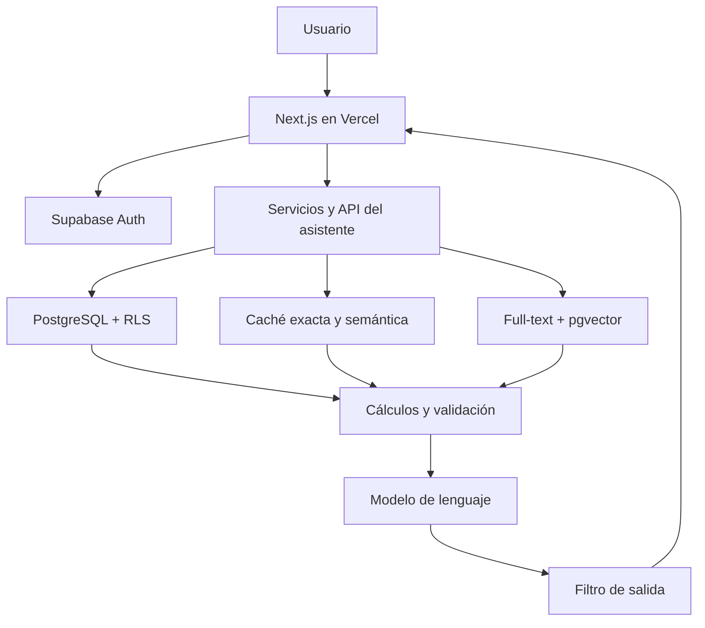

# Arquitectura del proyecto

## Objetivo

Reemplazar la planilla familiar por una aplicación web compartida, segura y auditable, con cálculos automáticos y un asistente capaz de responder preguntas usando SQL y RAG.

## Componentes

- **Frontend:** Next.js, React y TypeScript.
- **Aplicación:** componentes, casos de uso y validadores por módulo.
- **Base:** PostgreSQL administrado por Supabase.
- **Autenticación:** Supabase Auth por email.
- **Seguridad:** RLS y permisos por hogar.
- **IA:** API servidor, enrutador, caché, búsqueda híbrida y validación.
- **Despliegue:** GitHub y Vercel.

## Módulos funcionales

1. Hogares y miembros.
2. Cuentas y categorías.
3. Movimientos y transferencias.
4. Presupuesto mensual.
5. Pagos programados.
6. Tablero y proyecciones.
7. Importación de la planilla.
8. Asistente financiero con fuentes.

## Reglas financieras

- saldo de cuenta = saldo inicial + ingresos - gastos;
- disponible total = suma de saldos calculados;
- pagos pendientes = suma de órdenes `pending`;
- disponible proyectado = disponible total - pagos pendientes;
- gasto mensual = gastos confirmados dentro del periodo;
- variación presupuestaria = presupuesto - gasto real;
- una transferencia crea dos movimientos vinculados y no altera el patrimonio total.

Estas reglas se implementan una sola vez en la capa financiera y se reutilizan en interfaz, API y filtros de IA.

## Fuente de verdad y recuperación

| Información | Fuente |
|---|---|
| Importes, saldos y estados | SQL |
| Permisos | Auth + RLS |
| Coincidencias exactas | Full-text search |
| Similitud conceptual | pgvector |
| Explicación en lenguaje natural | Modelo, después de validar contexto |
| Respuesta reutilizada | Caché vigente y aislada por hogar |

## Datos y seguridad

Todas las entidades familiares se relacionan con `household_id`. Los vectores, documentos, caché y auditoría siguen el mismo límite. La IA no recibe claves administrativas ni puede eludir RLS.

## Ambientes

- **Local:** desarrollo y datos de prueba.
- **Preview:** pull requests desplegados por Vercel.
- **Producción:** rama estable, migraciones aplicadas y secretos de servidor.

Nunca se versionan `.env.local`, claves privadas ni datos financieros reales.

## Documentación relacionada

- [Arquitectura de IA y RAG](AI_RAG_ARCHITECTURE.md)
- [Diccionario de datos](DATA_DICTIONARY.md)
- [Seguridad](SECURITY.md)
- [Estructura del repositorio](PROJECT_STRUCTURE.md)
- [Plan diario](ROADMAP.md)
