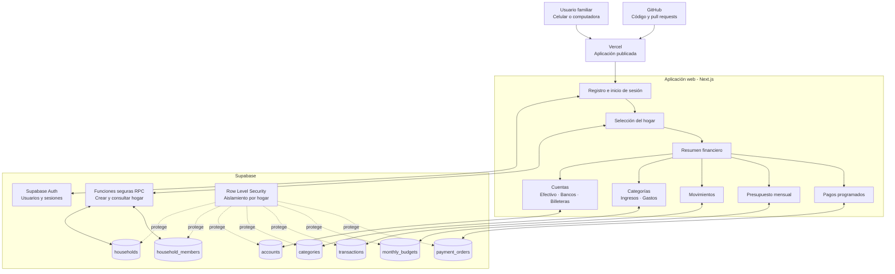
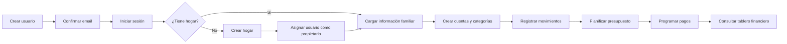

# Diagramas del proyecto

## Arquitectura general

## Flujo funcional

## Cálculos principales

- Disponible total = suma de los saldos de las cuentas.
- Disponible proyectado = disponible total - pagos pendientes.
- Cada usuario accede solamente a los datos de su hogar mediante las políticas RLS de Supabase.
