# Plan diario de implementación

Este plan conserva las cuatro etapas ya completadas y agrega la preparación arquitectónica necesaria para incorporar IA, RAG, caché semántica y búsqueda híbrida sin comprometer la exactitud financiera.

## Etapas completadas

| Día | Fecha | Etapa | Resultado |
|---|---|---|---|
| 1 | 03/08/2026 | Base del proyecto | Repositorio, documentación y aplicación Next.js |
| 2 | 04/08/2026 | Supabase | Esquema PostgreSQL, RLS y entorno local |
| 3 | 05/08/2026 | Acceso familiar | Registro, login, sesión y creación de hogar |
| 4 | 09/08/2026 | Cuentas y categorías | CRUD persistente por hogar |

## Nuevo plan de implementación

| Día | Fecha | Etapa | Entregable verificable |
|---|---|---|---|
| 5 | 10/08 | Refactorización modular | Separar UI, servicios, consultas, tipos y validadores |
| 6 | 11/08 | Motor financiero | Funciones únicas para saldos, periodos, monedas y proyecciones |
| 7 | 12/08 | Movimientos | CRUD, filtros, idempotencia y cálculo automático de saldos |
| 8 | 13/08 | Transferencias y conciliación | Transferencias dobles, estados y trazabilidad |
| 9 | 14/08 | Presupuesto | Plan mensual, inflación, copia y comparación contra lo real |
| 10 | 17/08 | Pagos programados | Vencimientos, estados, cuenta de origen y confirmación |
| 11 | 18/08 | Tablero real | Indicadores obtenidos desde SQL y datos persistidos |
| 12 | 19/08 | Auditoría y versionado | `audit_events`, `data_version` e invalidación por hogar |
| 13 | 20/08 | API del asistente | Endpoint servidor, autenticación, rate limit y contratos JSON |
| 14 | 21/08 | Intenciones y filtros | Clasificador, periodos, cuentas, categorías, moneda y estado |
| 15 | 24/08 | Caché exacta | Claves normalizadas, TTL, métricas e invalidación |
| 16 | 25/08 | Base vectorial | `pgvector`, documentos, secciones, embeddings y RLS |
| 17 | 26/08 | Caché semántica | Similitud, umbrales, aislamiento por hogar y reutilización segura |
| 18 | 27/08 | Búsqueda híbrida | Full-text + vectores + filtros estructurados + ranking RRF |
| 19 | 28/08 | RAG financiero | Enrutador SQL/vector/híbrido y construcción de contexto |
| 20 | 31/08 | Filtros de salida | Validación de fuentes, cifras, vigencia, privacidad y confianza |
| 21 | 01/09 | Evaluaciones de IA | Casos esperados, seguridad, precisión, latencia y coste |
| 22 | 02/09 | Importación de Excel | Mapeo, validación, vista previa e importación idempotente |
| 23 | 03/09 | Calidad integral | Pruebas, responsive, accesibilidad, rendimiento y seguridad |
| 24 | 04/09 | Publicación | Vercel, variables, migraciones, respaldo y manual de uso |

## Orden de dependencias

```mermaid
flowchart LR
    A["Módulos financieros"] --> B["Motor financiero"]
    B --> C["Auditoría y data_version"]
    C --> D["API del asistente"]
    D --> E["Caché exacta"]
    E --> F["pgvector"]
    F --> G["Caché semántica"]
    G --> H["Búsqueda híbrida"]
    H --> I["RAG"]
    I --> J["Filtros de salida"]
    J --> K["Evaluaciones"]
```

## Definición de terminado

Una etapa queda terminada cuando:

- el código compila y las migraciones son reproducibles;
- existen pruebas proporcionales al riesgo;
- RLS impide acceso entre hogares;
- los cálculos financieros se validan contra SQL;
- no se guardan secretos ni datos financieros reales en Git;
- se actualiza la documentación relacionada;
- existe un commit descriptivo;
- el resultado puede demostrarse.

## Criterios especiales para IA

- ninguna cifra se acepta sin recalcularla en PostgreSQL;
- ninguna respuesta cruza límites de hogar;
- toda respuesta indica periodo, moneda y fuentes;
- las acciones de escritura requieren confirmación;
- un cambio financiero invalida la caché anterior;
- los cambios de modelo o prompt deben superar las evaluaciones.
